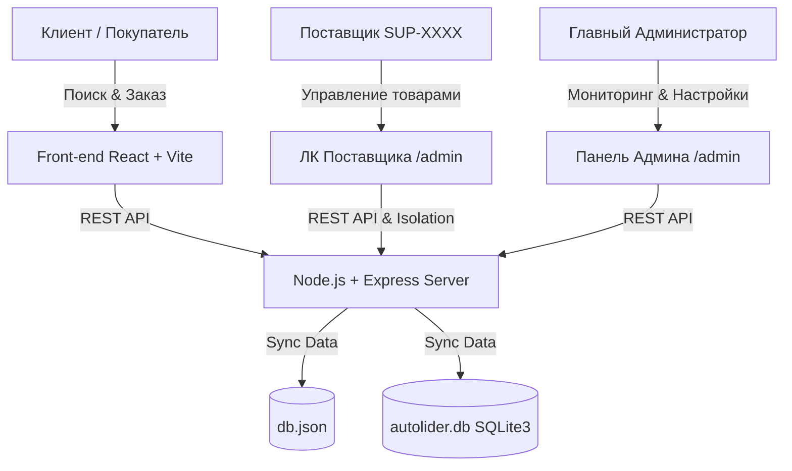

# 🚗 AutoLider Trade — Multi-Vendor E-Commerce Marketplace

<div align="center">


**Платформа для оптовой и розничной торговли автозапчастями и автотоварами.**  
Разработано командами экспертов в **ZIZ Inc.**

[Возможности](#-основные-возможности) • [Демо Доступы](#-демо-доступы) • [Архитектура](#-архитектура-системы) • [Быстрый запуск](#-быстрый-запуск)

</div>

---

## 🌟 Основные возможности

### 🛍️ 1. Публичный маркетплейс (Для покупателей)
* **Умный поиск и автоподбор**: Поиск по марке, модели, году выпуска авто, категории, артикулу и VIN-коду.
* **Быстрый заказ в 1 клик**: Моментальное оформление покупки по номеру телефона без регистрации.
* **Мульти-вендорная корзина**: Поддержка добавления в один чек товаров от разных независимых поставщиков.
* **Лояльность и бонусы**: Начисление и списание баллов при оформлении заказа.
* **Безопасная авторизация**: Вход по Email / Телефон через OTP-коды (Gmail SMTP + Rate Limiting от спама).
* **Готовность к эквайрингу**: Интеграция методов оплаты Freedom Pay и Kaspi.

### 🏬 2. Кабинет Поставщика (Supplier Portal)
* **Изолированный доступ**: Вход по уникальному коду поставщика (например `SUP-7745`) или логину.
* **Изоляция сборных заказов**: Поставщик видит **только свои товары** и свою часть выручки из мульти-вендорного чека.
* **Управление каталогом**: Просмотр остатков, быстрая корректировка цен и статусов наличия.
* **Массовый импорт**: Загрузка прайсов и товаров через файлы Excel/CSV.

### 🏢 3. Панель Управления (Admin Dashboard)
* **Сквозная аналитика**: Динамические графики выручки, заказов и топовых категорий.
* **Разграничение ролей**: Разделение прав доступа (Администратор, Менеджер, Поставщик, Оператор склада).
* **Управление филиалами**: Настройка комиссий поставщиков, складов и магазинов по городам.
* **Обработка VIN-запросов**: Централизованная работа с индивидуальными запросами от водителей.

---

## 📐 Архитектура системы



---

## 🔑 Демо доступы для тестирования

Вы можете протестировать систему под любым уровнем доступа:

| Роль | URL входа | Логин / Код | Пароль |
| :--- | :--- | :--- | :--- |
| **Главный Администратор** | `/admin/login` (вкладка *Администратор*) | `admin` | `admin` |
| **Поставщик (*Автогид Тараз*)** | `/admin/login` (вкладка *Поставщик*) | `SUP-7745` | `1234` |
| **Покупатель** | Главная страница ➔ *Войти* | Ваш номер телефона | OTP из SMS/Console |

---

## ⚡ Быстрый запуск

### 1. Требования
* Node.js v18.0 или выше
* npm или yarn

### 2. Установка зависимостей
```bash
npm install
```

### 3. Запуск проекта

#### Вариант А: Запуск в двух терминалах (Рекомендуется)

**Терминал 1 (Бэкенд Сервер):**
```bash
node server/index.js
```
*Сервер запустится на `http://localhost:5000`*

**Терминал 2 (Фронтенд React):**
```bash
npm run dev
```
*Приложение откроется на `http://localhost:5173`*

---

## 🛡️ Безопасность и Отказоустойчивость

* **Zero Broken Images**: Внедрен единый резервный механизм `/uploads/no-photo.png` с `onError` перехватом.
* **Защита от брутфорса**: Rate limiter на эндпоинтах авторизации и отправки OTP.
* **Шифрование**: Пароли пользователей защищены алгоритмом `bcrypt`.
* **Санитизация API**: Скрытие чувствительных полей из ответов серверов.

---

## 📄 Лицензия и Разработка

```text
---------------------------------------------------------------------
  Designed & Developed by ZIZ Inc.
  © 2026 AUTOLIDER Trade. All Rights Reserved.
---------------------------------------------------------------------
```

<div align="center">

**⚡ Сделано в ZIZ Inc**

</div>
